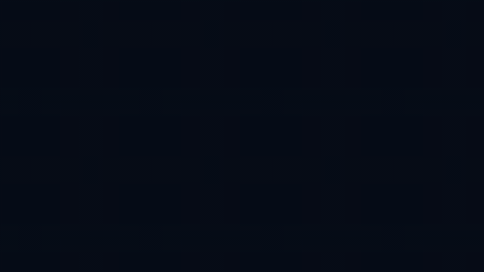

<div align="center">


# shotcraft

**撮って、その場で注釈・モザイク・クロップ。完全ローカル動作のスクリーンショット編集ツール**

[](https://github.com/joe41203/shotcraft/actions/workflows/ci.yml)
[](./package.json)
[](https://chromewebstore.google.com/detail/shotcraft/pkhbgheiebgdikjbhegjfbidgbphccfo)
[](./LICENSE)



[English](./README.en.md) · **日本語** · [简体中文](./README.zh-CN.md)

</div>

いま見ているタブを撮影し、そのまま**矢印・モザイク・テキスト・クロップ**などを描き込んで書き出せる Chrome 拡張（MV3）です。撮影から書き出しまでがブラウザの中で完結するので、画像がどこかへ送られることはありません。

バグ報告のスクショ、ダッシュボードの共有、手順書づくりなど、「撮って・隠して・強調して・渡す」までを 1 タブで済ませられます。


## インストール

[Chrome ウェブストア](https://chromewebstore.google.com/detail/shotcraft/pkhbgheiebgdikjbhegjfbidgbphccfo)から「Chrome に追加」でインストールできます。紹介ページは [shotcraft.pages.dev](https://shotcraft.pages.dev) です。

<details>
<summary>ローカルに読み込む（開発版）</summary>

```bash
pnpm install && pnpm build
```

1. Chrome で `chrome://extensions` を開く
2. 右上の「デベロッパーモード」を ON にする
3. 「パッケージ化されていない拡張機能を読み込む」で `.output/chrome-mv3` を選択する
</details>

## 使い方

拡張アイコンをクリックし、ポップアップの 2 つのボタンから撮影方法を選びます。

| ボタン | 動作 |
| --- | --- |
| 表示範囲をキャプチャ | アクティブなタブの表示領域全体を撮影します。 |
| 範囲を選択してキャプチャ | オーバーレイでカーソル下の要素をクリックしてその境界を撮るか、ドラッグして矩形を選びます（`Esc` でキャンセル）。 |

撮影後は新しいタブでエディタが開きます。ツールバーでツールと色を選び、画像の上にドラッグやクリックで描きます。編集内容は自動保存され、タブをリロードしても復元されます。

- **スタイルの変更**: ツールを選ぶと、そのボタンの真下に小さなパネル（フライアウト）が開きます。線種・矢印の形・文字サイズ・塗り・モザイクの強度など、そのツールに関係する項目だけが並びます。

  ここでの選択は次に描く図形の既定になります。すでに描いた図形を選択ツールで選んでから変えれば、その図形にすぐ反映されます（「番号」と「比率」だけはツール選択中のみ）。設定は次回エディタを開いたときにも残ります。
- **色**: ツールバーの色スウォッチが次に描く色になります。図形を選んでから色を選べば、その図形の色も変わります。パレットにない色は、右のスポイトボタンで画面から直接拾えます（他のウィンドウからも拾えます）。
- **書き出し**: 「形式」ボタンで PNG / JPEG / WebP を選び（JPEG・WebP は品質も）、「保存」でダウンロードします。「コピー」は貼り付け先を選ばないよう常に PNG です。
- **線の太さ**: 4px 固定です（変更する UI はありません）。

## ツール

| ツール | キー | 説明 |
| --- | --- | --- |
| 選択 | `V` | 図形を移動・リサイズ・回転します。複数選択とグループ化もできます。 |
| 矢印 | `A` | 矢頭は片側 / 両側 / 曲線から選べます。 |
| 直線 | `L` | 矢頭のない線を引きます。 |
| 矩形 | `R` | 塗りはなし / 半透明を選べます。 |
| 楕円 | `E` | 塗りはなし / 半透明を選べます。 |
| スポットライト | `O` | 囲んだ領域だけを明るく残し、他を暗幕で暗くします。暗幕は何枚置いても 1 枚で、注釈は常に明るいまま残ります。 |
| テキスト | `T` | 書体は同梱の Mochiy Pop One 固定。サイズは S / M / L のほか、四隅のハンドルで自由に変えられます。 |
| ペン | `P` | フリーハンドで描きます。手ブレ補正付き。 |
| マーカー | `M` | 蛍光ペンのように太く半透明で描きます。手ブレ補正付き。 |
| ステップ | `S` | クリックのたび連番の丸バッジ（①②③…）を置きます。「次を1に戻す」で採番をリセット。 |
| フキダシ | `B` | 角丸のフキダシ＋テキスト。しっぽは 4 辺を個別に ON / OFF でき、全 OFF なら背景プレート付きテキストになります。 |
| モザイク | `X` | 囲んだ範囲をピクセル化して伏せます。粗さは範囲の大きさから自動で決まり、強度でも調整できます。 |
| ぼかし | `U` | 囲んだ範囲をぼかして伏せます。四隅は角丸に仕上がります。 |
| スマート消しゴム | `D` | 周辺の色を取り込んだ IDW ブレンドで自然に塗り潰します。「隠した」痕跡を残さないので、通知バッジやカーソルを消して背景に溶け込ませる用途向け（単色〜緩いグラデ背景が得意）。 |
| クロップ | `C` | 不要な部分を切り落とします。比率は自由 / 1:1 / 4:3 / 16:9。`Enter` で確定し、undo で戻せます。 |

線種（実線 / 破線）は矢印・直線・矩形・楕円・ペンで選べます。モザイク・ぼかし・スマート消しゴム・スポットライトは**ベース画像だけ**を対象にし、注釈には掛かりません（注釈を隠したいときは最前面へ）。

### フチ（フレーム）

スクリーンショット全体をフレームで囲めます。白背景の資料に貼ったときに画像の境界が溶けるのを防ぎ、見栄えを整えられます。ツールに紐づかない画像単位の設定で、ツールバーのフチボタンからいつでも切り替えられます。

| 種類 | 見た目 | 追加で選べるもの |
| --- | --- | --- |
| 枠線 | 単色の線で囲む | 太さ（細 2px / 標準 6px / 太 12px）と色 |
| ブラウザ | 信号機ボタン＋アドレスバー付きのウィンドウ風（角丸） | アドレスバーの URL |
| ダーク | 暗いタイトルバー付きのウィンドウ風（角丸） | タイトルバーの文字 |

フレームは内容の**外側**に足すので元の内容は隠れず、そのぶん出力サイズが大きくなります。ブラウザ風の URL は撮影元が初期値ですが、**クエリ（`?...`）とハッシュ（`#...`）は落とします**（トークンの写り込み防止）。URL・タイトルはその画像固有の内容なので設定として保存しません。

## キーボードショートカット

ツール切り替えは上の[ツール表](#ツール)のキーです。以下は編集操作のショートカット（テキスト入力中は無効）。

| キー | 動作 |
| --- | --- |
| `Shift`（描画中） | 矢印・直線の角度を 0 / 45 / 90° にスナップ、矩形を正方形・楕円を正円に |
| ドラッグ中（自動） | 他図形・画像の端に吸着して赤いガイド線を表示（`Shift` で無効） |
| 空き領域からドラッグ | 範囲選択（ラバーバンド）で複数選択 |
| `Shift` + クリック | 選択に図形を追加 / 除外 |
| `Ctrl` / `Cmd` + `D` | 選択中の図形を複製（右下へ少しずらす） |
| `Alt`（`Option`）+ ドラッグ | 元を残して複製をドラッグ |
| `Ctrl` / `Cmd` + `G` | グループ化（`Shift` 併用で解除） |
| 矢印キー | 1px 移動（`Shift` 併用で 10px） |
| `]` / `[` | 1 つ前面 / 背面へ（`Shift` 併用で最前面 / 最背面） |
| `Delete` / `Backspace` | 選択中の図形を削除 |
| `Enter` | クロップ確定 / テキスト入力中は改行 |
| `Ctrl` / `Cmd` + `Enter` | テキストを確定 |
| `Esc` | 選択解除・クロップのキャンセル（未選択なら選択ツールへ）。テキスト入力中は入力を**確定**します |
| `Ctrl` / `Cmd` + `Z` | 元に戻す（`Shift` 併用または `Ctrl` / `Cmd` + `Y` でやり直し） |
| `Ctrl` / `Cmd` + `C` | 画像をクリップボードへコピー |
| `Ctrl` / `Cmd` + ホイール | カーソル位置を中心にズーム（`0` で全体フィット） |
| ホイール / トラックパッド | パン |

## プライバシー

- **完全ローカル動作**: 撮影・編集・書き出しのすべてがブラウザ内で完結し、画像データを外部へ送信しません。
- **外部リクエストなし**: 注釈フォント（Mochiy Pop One）も同梱しており、実行時に外部へ通信しません。
- **ディスクに残さない**: 撮影データと編集内容は `storage.session` に保存し、明示的な保存操作までディスクへ書き出しません。設定（色・線種・サイズ・書き出し形式・フチの種類など）だけは `storage.local` に保存しますが、画像データは含みません。
- **最小権限**: 要求する権限は次の 3 つだけで、`host_permissions` は要求しません。

| 権限 | 用途 |
| --- | --- |
| `activeTab` | アクティブなタブの表示領域のキャプチャ |
| `scripting` | 範囲選択オーバーレイの注入（静的な content script は使わず、ボタン操作の時点で `scripting.executeScript` で注入） |
| `storage` | キャプチャ結果と編集内容のセッション保存 |

## アーキテクチャ

[WXT](https://wxt.dev/) + vanilla TypeScript（フレームワークなし）で構築し、キャンバス描画に [Konva](https://konvajs.org/) を使っています。

**正はドキュメントモデル、Konva はその投影。** 図形はすべてシリアライズ可能なプレーンオブジェクト `Shape`（`lib/editor/doc.ts`）で表現し、画面上の Konva ノードは `EditorDoc` を描画に投影した使い捨てです。これにより保存・復元・undo/redo をすべてデータ操作として一貫して扱えます。

**undo/redo はスナップショット履歴**（`lib/editor/history.ts`）。past / present / future を持つ純粋なデータ構造で、ドラッグ中の中間状態は commit せず操作の確定時に 1 回だけ commit するため、履歴が中間状態で埋まりません。

**一時保存は `storage.session`。** キャプチャ画像（`capture-store.ts`）と編集内容（`doc-store.ts`）はブラウザを閉じるまで有効で、タブのリロードからは復元できディスクには残りません。新規図形用のスタイル設定だけは例外で `storage.local`（`style-prefs.ts`）に保存します。

```text
entrypoints/
  background.ts            Service Worker。キャプチャ処理の中核
  popup/                   拡張アイコンのポップアップ（撮影の起点）
  editor/                  編集タブ。Konva ステージ・ツールバー・各ツール
  region-select.content.ts 範囲選択オーバーレイ（scripting で動的注入）
lib/
  editor/                  ドキュメントモデル・履歴・永続化と純粋計算
                           （crop / mosaic / blur / spotlight / erase / border /
                            snap / selection / callout / step ほか）
  capture-store.ts         キャプチャの storage.session 保存
  geometry.ts              座標変換（CSS px から画像 px へ）
  theme.ts                 デザイントークンの TS 定数（Shadow DOM 用）
assets/tokens.css          デザイントークン（CSS 変数）と @font-face
public/                    同梱フォント（WOFF2・OFL.txt）と拡張アイコン
```

## 開発

```bash
pnpm install       # 依存をインストール
pnpm dev           # 専用プロファイルの Chrome を起動しホットリロード
pnpm build         # .output/chrome-mv3 に本番ビルド
pnpm zip           # 配布用の zip を生成
pnpm compile       # tsc --noEmit で型チェック
pnpm test          # Vitest でユニットテスト
```

クロップ座標・モザイク粒度・ぼかし半径・スマート消しゴムの IDW ブレンド・フチの寸法計算・整列スナップ・フキダシの折返し・ステップ採番といった純粋計算は `lib/editor/` に分離し、[Vitest](https://vitest.dev/) でテストしています。CI は compile → test → build → zip の順に実行します。

## 既知の制限

<details>
<summary>キャプチャできないページがある</summary>

`chrome://` などのブラウザ内部ページ、Chrome ウェブストア、拡張機能の管理ページ、他拡張のページでは、Chrome の制約によりキャプチャ・範囲選択ができません。実行すると拡張アイコンに失敗バッジ（赤背景の `!`。数秒で消えます）を表示し、Service Worker のコンソールに警告を出して終了します。
</details>

<details>
<summary>連続キャプチャはブラウザ側で制限される</summary>

`captureVisibleTab` はブラウザ側で 2 回 / 秒に制限されます。短時間に連続でキャプチャした場合、超過分は破棄せず、スロットが空くまで待ってから実行します。
</details>

<details>
<summary>JPEG は透過を保持できない</summary>

JPEG は透過を持てないため、書き出し前に白背景で合成してから出力します（透過部分が黒く潰れるのを防ぐ安全策）。角丸のフチを使った場合の四隅も同様で、PNG / WebP なら透過のまま残ります。
</details>

<details>
<summary>複数選択中はリサイズ・回転ができない</summary>

複数選択・グループ選択の状態では、シンプルさを保つため移動・削除・複製・微移動のみに対応します（単一選択に戻すとハンドルが復活します）。モザイク・ぼかし・スマート消しゴム・スポットライトは単一選択でも回転できず、テキストは四隅ハンドルでの拡大縮小のみ、ステップバッジは固定サイズで移動と削除のみです。
</details>

## フィードバック

不具合の報告や機能の要望は [Issue](https://github.com/joe41203/shotcraft/issues) へお寄せください。「このページで撮影できない」といった報告では、対象ページの URL と Chrome のバージョンがあると再現しやすくなります。

## クレジット

- **フォント**: テキスト注釈に [Mochiy Pop One](https://fonts.google.com/specimen/Mochiy+Pop+One)（SIL OFL 1.1、Copyright 2020 The Mochiypop Project Authors）を同梱しています。外部リクエストを避けるため Web フォント読み込みは使わず WOFF2 を同梱しており、容量は約 2.1 MB です。ライセンス全文は [`public/fonts/mochiy-pop-one/OFL.txt`](public/fonts/mochiy-pop-one/OFL.txt) を参照してください。UI は OS のシステムフォントを使います。
- **アイコン**: 本リポジトリオリジナルの拡張アイコン（`public/icon/`）を使用しています。

## ライセンス

ソースコードは [MIT License](./LICENSE)。同梱フォント Mochiy Pop One にはソースコードのライセンスとは独立に SIL Open Font License 1.1 が適用されます。
