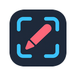
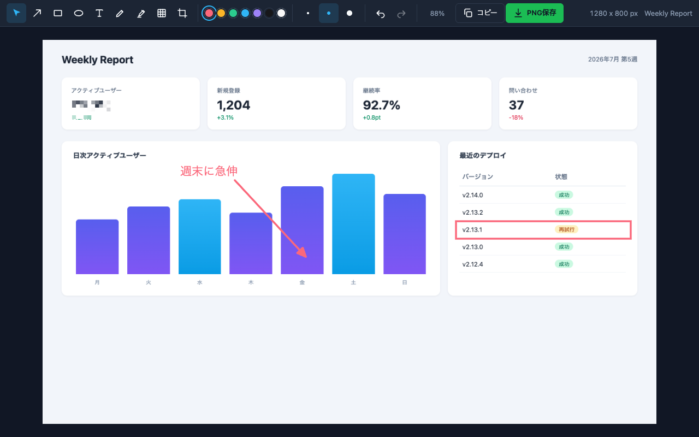
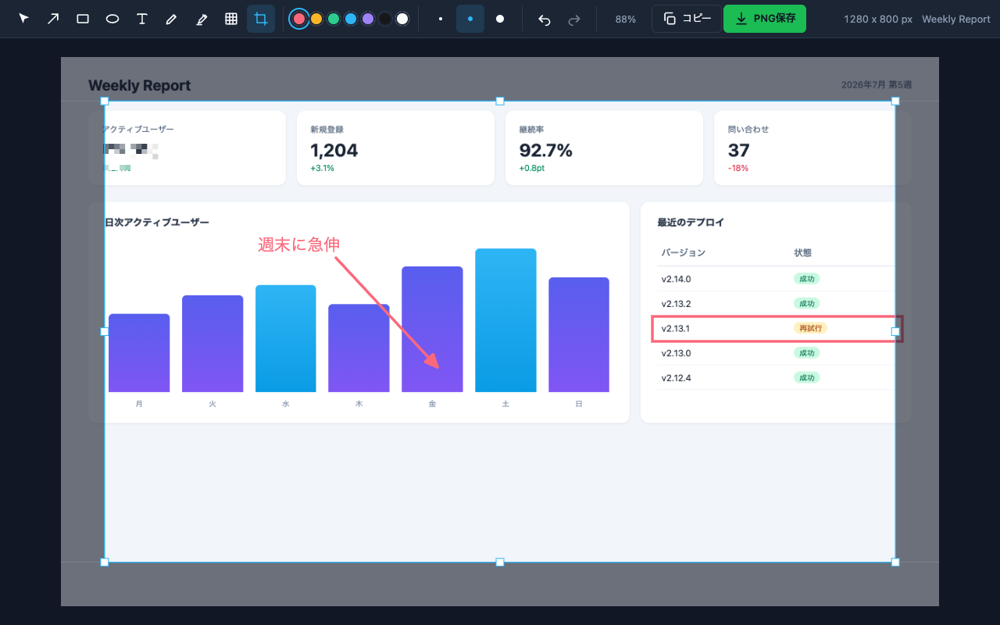

<div align="center">



# shotcraft

**撮って、その場で注釈・モザイク・クロップ。完全ローカル動作のスクリーンショット編集ツール**

[](https://github.com/joe41203/shotcraft/actions/workflows/ci.yml)
[](./package.json)
[](https://developer.chrome.com/docs/extensions/mv3/intro/)
[](https://wxt.dev/)
[](https://konvajs.org/)
[](https://www.typescriptlang.org/)
[](public/fonts/)
[](./LICENSE)

[](https://chromewebstore.google.com/detail/shotcraft/pkhbgheiebgdikjbhegjfbidgbphccfo)

</div>

---

shotcraft は、いま見ているタブを撮影し、そのまま**矢印・矩形・テキスト・モザイク・クロップ**などの注釈を描き込んで PNG で書き出せる Chrome 拡張です。撮影から書き出しまでがブラウザ内で完結し、画像データを外部サーバーへ送信しません。バグ報告のスクショ、ダッシュボードの共有、手順書づくりなど、「撮って・隠して・強調して・渡す」を一気通貫でこなします。

[WXT](https://wxt.dev/) + vanilla TypeScript で構築し、キャンバス描画は [Konva](https://konvajs.org/) を使っています。

## スクリーンショット

撮影した画像に注釈・モザイク・強調を施したところ。矢印で注目点を示し、伏せたい箇所はモザイクで隠し、重要な行を矩形で囲んでいます。



クロップツールを選ぶと画像の内側にトリミング枠が現れます。ハンドルをドラッグして範囲を決め、`Enter` で確定します。



## 特長

### 撮影

- **表示範囲をキャプチャ**: アクティブなタブの表示領域全体をワンクリックで撮影します。
- **範囲を選択してキャプチャ**: ページ上にオーバーレイを重ね、選んだ矩形だけを撮影します。マウスを動かすとカーソル下の要素が DevTools のインスペクタ風にハイライトされ、**クリック 1 回でその要素の境界どおりに撮影**できます（`Alt`（`Option`）を押している間は親要素へ 1 段階広げてハイライトします）。従来どおり**ドラッグすれば好きな矩形を自由選択**でき、ドラッグ中は選択領域とサイズ（幅 x 高さ）を表示します。`Esc` でキャンセルできます。
- **ページ全体をキャプチャ**: ページを上から表示領域単位で自動スクロールしながら撮影し、1 枚の縦長画像に連結します。表示領域に収まらない長いページを丸ごと 1 枚にできます。`captureVisibleTab` のレート制限（2 回 / 秒）を守るため、タイル数に応じて数秒かかります。撮影の間は拡張アイコンのバッジにタイル進捗（`1/5` 形式。桁が収まらないときは `60%` のように割合）を表示し、完了するとバッジは消えます。固定ヘッダーは 2 枚目以降を非表示にして各タイルへの写り込みを防ぎ、撮影後に元へ戻します。

### 編集

- **15 種類のツール**: 選択・矢印・直線・矩形・楕円・スポットライト・テキスト・ペン・蛍光マーカー・ステップ・フキダシ・モザイク・ぼかし・スマート消しゴム・クロップ。
- **番号付きステップ注釈**: ステップツール（`S`）でクリックするたびに連番の丸バッジ（①②③…）を置きます。手順の順番を示すのに便利です。番号は配置時点で自動採番され、途中のバッジを削除しても残りは振り直しません。フライアウトの「番号」セクションの「次を1に戻す」を押すと、次に置くバッジの番号を 1 に戻せます（別の手順を 1 から振り直したいときに使います。効くのは次の 1 個だけで、以降はまた連番に戻ります）。選択ツールで移動・削除できます。
- **コールアウト（フキダシ）**: フキダシツール（`B`）でドラッグして角丸のフキダシを描き、そのままテキストを入力します。しっぽ（三角）は本体の辺の中央から外向きに出ます。フライアウトの「しっぽ」セクションで向き（下 / 上 / 左 / 右）を**複数**選べ（各辺を個別に ON / OFF）、**すべて OFF にするとしっぽなし**（背景プレート付きテキストとして使えます）。選んだしっぽは新しく描くフキダシの既定になり、フキダシを選択中に切り替えるとその図形へ即座に適用されます（既定は「下」）。選択で移動・リサイズ・再編集でき、リサイズするとテキストが折り返して高さが追従します。
- **直線**: 矢印ツールの姉妹（`L`）。矢頭のない直線を引きます。線種（実線 / 破線）に対応し、描画中に `Shift` を押すと角度が 0 / 45 / 90° 刻みにスナップします。
- **スタイルのフライアウト**: ツールを選ぶと、そのツールボタンの真下に小さなパネル（フライアウト）が現れ、そのツールに合ったスタイルを選べます。線系ツール（矢印・直線・矩形・楕円・ペン）では線種（実線 / 破線）、矢印ツールでは加えて矢印スタイル（片側 / 両側 / 曲線）、テキスト・フキダシツールでは文字サイズ（S / M / L）、フキダシツールでは加えてしっぽの向き（下 / 上 / 左 / 右 の複数選択・全 OFF でしっぽなし）、矩形・楕円ツールでは加えて塗り（なし / 半透明）、モザイク・ぼかしツールでは強度（弱 / 標準 / 強）、スポットライトツールでは暗さ（薄め / 標準 / 濃いめ）、ステップツールでは番号（次を1に戻す）、クロップツールでは比率（自由 / 1:1 / 4:3 / 16:9）が出ます。ツールを選んでいる間は出しっぱなしで、別のツールに切り替えると消えます。選択ツールで対応する図形を選ぶと、その図形を描くツールボタンの下に同じフライアウトが出て、そこからの変更はその図形へ即座に反映されます（ステップの番号・クロップの比率はツールを選んでいる間だけ出るセクションで、図形選択では出ません）。ボタンはキーボードでも操作でき（Tab でツールボタンの並びから到達）、画面端でははみ出さないよう位置を調整します。
- **矢印スタイル（片側 / 両側 / 曲線）**: 矢印ツールを選ぶ（または矢印を選択する）と、矢印ボタンの下のフライアウトに「矢印」セクション（片側 / 両側 / 曲線）が現れます。片側は終端のみ、両側は両端に矢頭を付け、曲線は始点と終点をゆるやかな弧で結びます（矢頭は終端の向きに沿います）。新しく描く矢印に反映され、矢印を選択中に切り替えるとその矢印へ即座に適用されます。破線は 3 スタイルすべてで機能します。選んだスタイルは次回エディタを開いたときにも引き継がれます。
- **線種（実線 / 破線）**: 矢印・直線・矩形・楕円・ペンでは、ツールボタンの下のフライアウトの「線種」セクションで実線と破線を切り替えられます。新しく描く図形に反映され、線系の図形を選択中に切り替えるとその図形へ即座に適用されます。
- **文字サイズ（S / M / L）**: テキスト・フキダシツールを選ぶ（またはテキスト・フキダシ図形を選択する）と、フライアウトの「サイズ」セクションで文字サイズ（S=18 / M=24 / L=36px）を選べます。新しく描くテキスト・フキダシの既定になり、テキスト・フキダシを選択中に切り替えるとその図形へ即座に適用されます（フキダシは文字が大きくなると本体の高さも折り返しに合わせて広がります）。四隅ハンドルのドラッグで S / M / L 以外の連続値にしたテキストを選ぶと、どのボタンも選択表示になりません。
- **塗り（なし / 半透明）**: 矩形・楕円ツールを選ぶ（または矩形・楕円図形を選択する）と、フライアウトの「塗り」セクションで塗りのあり / なしを選べます。半透明の塗りは枠線と同じ色の淡い塗り（フキダシの背景と同じ濃さ）で、内側をうっすら塗りつぶします。新しく描く図形の既定になり、矩形・楕円を選択中に切り替えるとその図形へ即座に適用されます。既定は「なし」（枠線のみ）です。
- **しっぽの向き（下 / 上 / 左 / 右・複数選択）**: フキダシツールを選ぶ（またはフキダシ図形を選択する）と、フライアウトの「しっぽ」セクションで三角のしっぽを出す辺を選べます。各辺を個別に ON / OFF でき（複数方向に同時にしっぽを出せます）、**すべて OFF にするとしっぽなし**になり、背景プレート付きのテキストとして使えます。選んだしっぽは本体の各辺の中央から外向きに出ます。新しく描くフキダシの既定になり、フキダシを選択中に切り替えるとその図形へ即座に適用されます。既定は「下」1 本で、しっぽの向きを持たない旧データは下向きとして描かれます（エディタ表示と書き出しで同じ見た目になります）。
- **ステップ番号のリセット**: ステップツールを選ぶと、フライアウトの「番号」セクションに「次を1に戻す」ボタンが出ます。押すと次に置くバッジの番号が 1 になり、別の手順を 1 から振り直せます。効くのは次の 1 個だけで、1 を置いたら以降はまた連番（2, 3, …）に戻ります。既存バッジの番号は変わりません。
- **クロップの比率（自由 / 1:1 / 4:3 / 16:9）**: クロップツールを選ぶと、フライアウトの「比率」セクションでトリミング枠のアスペクト比を選べます。比率を選ぶと枠のドラッグ・ハンドル操作がその比率に拘束され（自由は従来どおり縦横自在）、画像範囲内に収まります。比率を切り替えると、いま出ている枠は中心を保ったままその比率に整形されます。選んだ比率は次回エディタを開いたときにも引き継がれます（クロップの確定結果は従来どおり単一の矩形として扱われます）。
- **手ブレ補正（ペン・マーカー）**: ペンと蛍光マーカーは、入力点の間引きとなめらかな曲線補間で手ブレをならして描きます。描いた軌跡の形はそのまま保ち、直線化や図形認識はしません。破線（ペン）も引き続き機能し、ドラッグ中のプレビューと確定後の見た目が一致します。
- **色の即時変更**: 色スウォッチは、次に描く図形の色になるだけでなく、図形を選択中に選ぶとその図形の色へ即座に反映されます（矢印・直線・矩形・楕円・ペン・マーカー・テキスト・ステップ・フキダシが対象。モザイク・ぼかし・スポットライトは色を持ちません）。
- **スタイルは前回の選択を記憶**: 選んだ色・線種・矢印スタイル・文字サイズ・塗り・強度・暗さ・フキダシのしっぽの向き・クロップの比率・書き出し形式と品質は次回エディタを開いたときにも引き継がれ、前回の設定で編集を始められます。
- **描画中の Shift 制約**: 矢印・直線を引くときに `Shift` を押すと角度が 0 / 45 / 90° 刻みにスナップし、矩形は正方形に、楕円は正円になります。
- **複製・微移動・重ね順**: 選択中の図形は `Cmd` / `Ctrl` + `D` で複製でき（`Alt`（`Option`）+ ドラッグでも元を残して複製をドラッグできます）、矢印キーで 1px（`Shift` 併用で 10px）ずつ微調整できます。`]` / `[` で前面 / 背面へ、`Shift` 併用で最前面 / 最背面へ重ね順を変えられます。ステップバッジを複製すると番号は次の連番に自動採番されます。
- **複数選択・一括操作**: 選択ツールで空き領域からドラッグすると範囲選択の矩形（ラバーバンド）が現れ、触れた図形をまとめて選択します。`Shift` + クリックで 1 つずつ選択に追加・除外でき、`Shift` + 範囲選択で既存の選択に足し引きできます。複数選択したまま、ドラッグでの一括移動・削除・`Cmd` / `Ctrl` + `D` の一括複製・矢印キーの一括微移動ができます（複数選択中はシンプルさを保つためリサイズ・回転はできません）。
- **グループ化**: 複数選択して `Cmd` / `Ctrl` + `G` でひとまとめのグループにできます。グループのどれか 1 つをクリック（または範囲選択）すると同じグループ全体が選ばれ、まとめて移動・削除・複製・微移動できます。`Shift` + `Cmd` / `Ctrl` + `G` で解除します。グループごと複製すると、複製側は元と混ざらない新しいグループになります。
- **整列スナップ（ガイド）**: 図形をドラッグすると、他の図形や画像全体の端（左 / 中央 / 右・上 / 中央 / 下）に近づいたところで吸着し、赤いガイド線が出ます。端をきれいに揃えたり中央に合わせたりを目測なしで行えます。`Shift` を押している間は吸着せず自由に動かせます。吸着の効き幅は画面上で一定（ズームに追従）です。
- **モザイク**: ドラッグした矩形をピクセル化して情報を伏せます。粗さは範囲の大きさから自動で決まり、移動・リサイズすると都度計算し直します。フライアウトの「強度」（弱 / 標準 / 強）で粒度の倍率を選べ、選択中のモザイクに切り替えると即座に再ピクセル化します。
- **ぼかし**: モザイクの姉妹ツール（`U`）。ドラッグした矩形のベース画像をガウスぼかしにして情報を伏せます。ぼかしの強さは範囲の大きさから自動で決まり、移動・リサイズすると都度計算し直します。パッチの四隅は角丸で仕上げます（スポットライトの穴と統一感のある半径ルール。モザイクは従来どおり角のまま）。フライアウトの「強度」（弱 / 標準 / 強）でぼかし半径の倍率を選べ、選択中のぼかしに切り替えると即座に掛け直します。
- **スマート消しゴム（なじませ）**: モザイク・ぼかしの姉妹ツール（`D`）。ドラッグした矩形のベース画像を、周辺（矩形の 4 辺の縁）の色を取り込んだ逆距離重み（IDW）ブレンドで自然に塗り潰します。縁に別物体（隣の絵文字・アイコンなど）が写り込んでいても、外れ値除去と距離減衰で領域内へ筋（スメア）が伸びないようにしています。モザイク・ぼかしと違い「何かを隠した」痕跡を残さないので、通知バッジ・カーソル・不要な UI 要素などを消して背景に溶け込ませる用途に向きます。単色〜緩いグラデーション背景でよくなじみます（模様の込み入った背景は苦手です）。仕上げに領域内へ弱いぼかしを 1 回だけかけてならします。色・線種・強度などのオプションはありません。移動・リサイズすると都度計算し直します（回転はできません）。
- **スポットライト（暗幕）**: ドラッグで囲んだ領域だけを明るく残し、それ以外の画像全体を暗くして視線を誘導します（`O`）。穴は角丸で、縁が柔らかくぼける（フェザー）ので硬い切り口になりません。複数置いても暗幕は 1 枚のまま、囲んだ数だけ明るい穴が増えます。注釈（矢印・テキスト・フキダシ等）は描き順に関係なく常に暗幕より上＝明るいまま残り、暗くなるのはベース画像とモザイク・ぼかし・スマート消しゴムだけです。フライアウトの「暗さ」（薄め / 標準 / 濃いめ）で暗幕の濃さを選べます（暗さは 1 枚の暗幕全体に効く画像単位の設定で、変更は元に戻す対象です）。選択で移動・リサイズできます。
- **クロップ**: トリミング枠で不要部分を切り落とします。フライアウトの「比率」（自由 / 1:1 / 4:3 / 16:9）で枠のアスペクト比を拘束できます。確定後にさらに絞り込むこともでき、元に戻すで解除できます。
- **テキスト注釈**: キャンバス上に直接文字を書き込めます。書体はかわいい丸文字フォント Mochiy Pop One（モッチーポップ）を同梱・固定で使います。サイズはフライアウトの「サイズ」（S / M / L）でプリセットから選べるほか、選択したテキストの四隅ハンドルをドラッグして連続的に拡大縮小もできます。移動は選択ツールまたはテキストツールでドラッグ、修正はダブルクリックで再編集できます。
- **やり直し自在**: すべての操作を undo / redo でき、色も選べます。
- **UI テーマ 5 種**: ポップアップ下部のテーマ行で拡張の UI 配色を 5 種（ミッドナイト（既定）/ ライト / オーシャン / フォレスト / サンセット）から選べます。丸い色見本をクリックすると即座に切り替わり、選んだテーマは `storage.local` に保存されて次回以降も引き継がれ、ポップアップとエディタの両方に適用されます（ポップアップで変えると開いているエディタにもその場で反映されます）。ライトは白系背景・ダーク文字で、主要な文字色は背景に対し WCAG コントラスト比 4.5:1 以上（補助文字も 3:1 以上）を満たします。これは拡張の UI（ツールバー・ポップアップ）の色で、キャンバスに描く注釈の色パレット（色スウォッチ）とは別物です。範囲選択オーバーレイ（ページ上に一時的に重ねる UI）はテーマ切替の対象外です。

### 出力

- **保存（形式を選べる）**: クロップ適用後の画像をファイルとしてダウンロードします。ツールバー右端の「形式」ボタンで **PNG / JPEG / WebP** を選べ（クリックで直下にフライアウトが開き、JPEG / WebP のときは品質「高（0.92）/ 標準（0.85）/ 低（0.7）」も選べます。外側クリックや `Esc` で閉じます）、「保存」ボタンでその形式のファイルをダウンロードします（拡張子も `.png` / `.jpg` / `.webp` に追従します）。JPEG は透過を持てないため、書き出し前に白背景で合成してから出力します。選んだ形式・品質は次回にも引き継がれます（既定は PNG）。
- **クリップボードへコピー**: `Ctrl` / `Cmd` + `C`（または「コピー」ボタン）で画像を直接コピーし、そのまま貼り付けられます。**コピーは互換性のため常に PNG** です（形式の選択は保存にのみ効きます）。
- 出力はベース画像・モザイク・ぼかし・スマート消しゴム・スポットライト・注釈を合成したもので、常にキャプチャ原寸です。選択枠やトリミング枠は含まれません。

### プライバシー

- **完全ローカル動作**: 撮影・編集・書き出しのすべてがブラウザ内で完結します。画像データを外部サーバーへ送信しません。
- **外部リクエストなし**: 注釈フォント（Mochiy Pop One）も拡張に同梱しており、実行時に外部へ通信しません。UI は OS のシステムフォントを使います。
- **最小権限**: 要求する権限は `activeTab` / `scripting` / `storage` の 3 つだけです。`host_permissions` は要求しません。
- **ディスクに残さない**: 撮影データと編集内容は `storage.session`（ブラウザを閉じるまで有効なセッションストレージ）に保存し、明示的な保存操作をするまでディスクへは書き出しません。
- **設定はブラウザ内に保存**: 新規図形用の設定（色・線種・矢印スタイル・文字サイズ・塗り・強度・暗さ・フキダシのしっぽの向き・クロップの比率・書き出し形式と品質）と UI テーマ（ミッドナイト / ライト / オーシャン / フォレスト / サンセット）だけはブラウザ内の `storage.local` に保存し、次回の編集に引き継ぎます。設定は画像データを含まず、外部へ送信しません。

## インストール

### Chrome ウェブストアから

[Chrome ウェブストアの shotcraft ページ](https://chromewebstore.google.com/detail/shotcraft/pkhbgheiebgdikjbhegjfbidgbphccfo)から「Chrome に追加」でインストールできます。

### ローカルに読み込む（開発版）

```bash
pnpm install
pnpm build
```

`pnpm build` すると `.output/chrome-mv3/` に MV3 拡張一式が生成されます。これを Chrome に読み込みます。

1. Chrome で `chrome://extensions` を開く
2. 右上の「デベロッパーモード」を ON にする
3. 「パッケージ化されていない拡張機能を読み込む」をクリックし、`.output/chrome-mv3` を選択する

## 使い方

ツールバーの拡張アイコンをクリックしてポップアップを開き、3 つのボタンから選びます。

| ボタン | 動作 |
| --- | --- |
| 表示範囲をキャプチャ | 現在アクティブなタブの表示領域全体を撮影します。 |
| 範囲を選択してキャプチャ | オーバーレイでカーソル下の要素をクリックしてその境界を撮るか、ドラッグして選んだ矩形を撮影します（`Esc` でキャンセル）。 |
| ページ全体をキャプチャ | ページを自動スクロールしながら撮影し、1 枚の縦長画像に連結します。 |

どちらもキャプチャ後に新しいタブでエディタが開きます。上部のツールバーからツール・色を選び、画像の上にドラッグやクリックで注釈を描きます。線の太さは 4px 固定です。

- **描画**: 矢印・直線・矩形・楕円はドラッグで描画します。ペンと蛍光マーカーはフリーハンドで、マーカーは太く半透明に描かれます。描画中に `Shift` を押すと、矢印・直線は角度が 0 / 45 / 90° 刻みにスナップし、矩形は正方形・楕円は正円になります。
- **直線**: 直線ツール（`L`）でドラッグすると矢頭のない直線を引けます。矢印ツールの姉妹で、線種（実線 / 破線）や `Shift` の角度スナップにも対応します。
- **スタイルのフライアウト**: 図形のスタイルは、ツールボタンの真下に現れる小さなパネル（フライアウト）で選びます。ツールを選ぶとそのツールに合ったセクション（線種・矢印スタイル・文字サイズ・しっぽの向き・塗り・強度・暗さ・番号・比率）だけがフライアウトに出しっぱなしになり、別のツールに切り替えると消えます。選択ツールで対応する図形を選ぶと、その図形を描くツールボタンの下にフライアウトが出て、そこからの変更はその図形へ即座に反映されます（ステップの「番号」・クロップの「比率」はツール選択中だけ出るセクションで、図形選択では出ません）。フライアウト内のボタンはキーボードでも操作でき（Tab でツールボタンの並びから到達）、画面端でははみ出さないよう位置を調整します。
- **矢印スタイル**: 矢印ツール（`A`）を選ぶ（または矢印を選択する）と、矢印ボタンの下のフライアウトに「矢印」セクション（片側 / 両側 / 曲線）が現れます。片側は終端のみ、両側は両端に矢頭を付け、曲線は始点・終点をゆるやかな弧で結びます。ここで選んだスタイルは次に描く矢印の既定になり、矢印を選択中に切り替えるとその矢印へ即座に反映されます。破線は 3 スタイルすべてに掛かります。
- **線種**: 矢印・直線・矩形・楕円・ペンのツールを選ぶ（または線系の図形を選択する）と、そのツールボタンの下のフライアウトに「線種」セクション（実線 / 破線）が現れます。ここで選んだ線種は次に描く図形の既定になり、線系の図形を選択中に切り替えるとその図形へ即座に反映されます。
- **文字サイズ**: テキスト・フキダシツールを選ぶ（またはテキスト・フキダシ図形を選択する）と、フライアウトに「サイズ」セクション（S=18 / M=24 / L=36px）が現れます。ここで選んだサイズは次に描くテキスト・フキダシの既定になり、テキスト・フキダシを選択中に切り替えるとその図形へ即座に反映されます（フキダシは本体の高さが文字量に合わせて追従します）。四隅ハンドルのドラッグで S / M / L 以外の値にしたテキストを選ぶと、どのボタンも選択表示になりません。
- **塗り**: 矩形・楕円ツールを選ぶ（または矩形・楕円図形を選択する）と、フライアウトに「塗り」セクション（なし / 半透明）が現れます。半透明は枠線と同じ色の淡い塗りで内側をうっすら塗ります。ここで選んだ塗りは次に描く図形の既定になり、矩形・楕円を選択中に切り替えるとその図形へ即座に反映されます。
- **強度（モザイク・ぼかし）**: モザイク・ぼかしツールを選ぶ（またはモザイク・ぼかし図形を選択する）と、フライアウトに「強度」セクション（弱 / 標準 / 強）が現れます。強度は自動で決まる粒度・ぼかし半径への倍率で、強いほど粗く・強くなります。ここで選んだ強度は次に描く図形の既定になり、モザイク・ぼかしを選択中に切り替えるとその図形へ即座に反映されます（再ピクセル化 / 再ぼかし）。
- **暗さ（スポットライト）**: スポットライトツールを選ぶ（またはスポットライト図形を選択する）と、フライアウトに「暗さ」セクション（薄め / 標準 / 濃いめ）が現れます。暗さは 1 枚の暗幕全体に効く画像単位の設定なので、変更は元に戻す対象になります。ここで選んだ暗さは次に開く画像の既定にも引き継がれます。
- **しっぽの向き（フキダシ）**: フキダシツール（`B`）を選ぶ（またはフキダシ図形を選択する）と、フライアウトに「しっぽ」セクション（下 / 上 / 左 / 右）が現れます。各辺を個別に ON / OFF でき、複数方向に同時に出せるほか、すべて OFF にするとしっぽなし（背景プレート付きテキスト）になります。ここで選んだしっぽは次に描くフキダシの既定になり、フキダシを選択中に切り替えるとその図形へ即座に反映されます（既定は「下」）。
- **番号のリセット（ステップ）**: ステップツール（`S`）を選ぶと、フライアウトに「番号」セクションの「次を1に戻す」ボタンが現れます。押すと次に置くバッジの番号が 1 になります（別の手順を 1 から振り直したいときに使います）。効くのは次の 1 個だけで、以降はまた連番に戻ります。既存バッジの番号は変わりません。
- **比率（クロップ）**: クロップツール（`C`）を選ぶと、フライアウトに「比率」セクション（自由 / 1:1 / 4:3 / 16:9）が現れます。比率を選ぶとトリミング枠のドラッグ・ハンドル操作がその比率に拘束され、画像範囲内に収まります（自由は縦横自在）。比率を切り替えると、いま出ている枠は中心を保ったままその比率に整形されます。選んだ比率は次に開くときの既定にも引き継がれます。
- **色の変更**: ツールバーの色スウォッチは次に描く図形の色になります。さらに、図形を選択した状態で色を選ぶと、その図形の色がその場で変わります（矢印・直線・矩形・楕円・ペン・マーカー・テキスト・ステップ・フキダシが対象。モザイク・ぼかし・スポットライトは色を持たないため対象外）。
- **複製・微移動・重ね順**: 選択ツールで図形を選び、`Cmd` / `Ctrl` + `D` で右下に少しずらして複製します（複製した図形が選択状態になります）。`Alt`（`Option`）を押しながらドラッグすると、元を残して複製をその場からドラッグできます。矢印キーで 1px ずつ（`Shift` 併用で 10px ずつ）動かして位置を微調整できます（連続して動かしても履歴は 1 手にまとまります）。`]` で 1 つ前面へ、`[` で 1 つ背面へ、`Shift+]` / `Shift+[` で最前面 / 最背面へ重ね順を変えられます。ステップバッジを複製すると番号は次の連番へ自動採番され、同じ番号が重複しません。
- **複数選択・一括操作**: 選択ツールで空き領域からドラッグすると範囲選択の矩形（ラバーバンド）が出て、触れた図形をまとめて選択します。`Shift` + クリックで図形を 1 つずつ選択に足し引きでき、`Shift` を押しながらの範囲選択でも既存の選択に足し引きできます。複数選択したまま、ドラッグでの一括移動・`Delete` / `Backspace` の一括削除・`Cmd` / `Ctrl` + `D` の一括複製・矢印キーの一括微移動ができます。複数選択中はシンプルさを保つため、リサイズ・回転はできません（単一選択に戻すとハンドルが復活します）。
- **グループ化**: 複数選択した状態で `Cmd` / `Ctrl` + `G` を押すと、それらの図形が 1 つのグループになります。グループに属する図形をクリックまたは範囲選択すると、同じグループの図形すべてが一緒に選ばれ、既存の複数選択と同じくまとめて移動・削除・複製・微移動できます（グループは分割して選択できません）。`Shift` + `Cmd` / `Ctrl` + `G` で選択中グループを解除します。グループを `Cmd` / `Ctrl` + `D` や `Alt`（`Option`）+ ドラッグで複製すると、複製された図形には新しいグループが割り当てられ、元のグループとは混ざりません。グループ化はツールバーには出さず、ショートカットのみで操作します。
- **整列スナップ（ガイド）**: 図形をドラッグしている間、他の図形（ドラッグ対象外）や画像全体のバウンディングボックスの端（左 / 中央 / 右・上 / 中央 / 下）に自分の端が近づくと吸着し、揃った位置に赤いガイド線が表示されます（Figma / Snagit の Canvas Snapping 風）。x 軸・y 軸それぞれで最も近い吸着候補（自分の左 / 中央 / 右 × 相手の左 / 中央 / 右の 9 通り）を選び、両軸で吸着すればガイドは 2 本出ます。画像全体を 1 つのボックスとして扱うので、キャンバスの端や中央への吸着も自然に効きます。吸着のしきい値は約 6px で、ズーム率で換算するため画面上では常に一定の効き幅になります。`Shift` を押している間はスナップを無効にして自由に動かせます（グループ・複数選択の一括移動でも同じく効きます）。ガイド線はドラッグを終えると消えます。
- **ステップ番号**: ステップツール（`S`）でクリックすると、その位置に連番の丸バッジ（①②③…）が置かれます。クリックのたびに番号が 1 つ増えます。手順を順番に示すのに使います。フライアウトの「番号」セクションの「次を1に戻す」を押すと、次に置くバッジの番号を 1 に戻せます（効くのは次の 1 個だけで、以降はまた連番）。選択ツールで移動・削除でき、途中のバッジを削除しても残りの番号は振り直しません。
- **フキダシ**: フキダシツール（`B`）でドラッグして角丸のフキダシ本体を描くと、続けてテキストを入力できます（`Enter` 改行 / `Ctrl`・`Cmd` + `Enter` または `Esc` で確定）。しっぽ（三角）は本体の辺の中央から外向きに出ます。フライアウトの「しっぽ」セクションで向き（下 / 上 / 左 / 右）を複数選べ（全 OFF でしっぽなし。既定は「下」）。選択ツールで移動・リサイズでき、リサイズするとテキストが折り返して高さが追従します。ダブルクリックで文言を再編集できます。
- **テキスト**: テキストツールで空き領域をクリックした位置に入力欄が開きます。`Enter` で改行、`Ctrl` / `Cmd` + `Enter` または `Esc`、あるいは入力欄の外をクリックで確定します。日本語入力（IME）の変換確定に使う `Enter` で入力欄が閉じることはありません。
  - **サイズ**: 作成したテキストを選択すると四隅にハンドルが出ます。ハンドルをドラッグすると縦横比を保ったまま拡大縮小し、フォントサイズが連続的に変わります（8〜200px）。
  - **移動**: 選択ツールでもテキストツールでも、テキストをドラッグして動かせます。テキストツール中に既存テキストの上でクリックすると、新規作成ではなくそのテキストが選択され、そのままドラッグで移動できます。
  - **修正**: テキストをダブルクリックすると入力欄が再び開き、文言を編集できます（選択ツール・テキストツールのどちらでも動きます）。
  - **書体**: テキスト注釈の書体は同梱のかわいい丸文字フォント Mochiy Pop One（モッチーポップ）に固定です。UI（ツールバー・ポップアップ）は OS のシステムフォントを使います。
- **モザイク**: モザイクツール（`X`）でドラッグした矩形範囲をピクセル化します。選択ツールで移動・リサイズ・削除でき、変形するとピクセル化を計算し直します。フライアウトの「強度」（弱 / 標準 / 強）で粒度の倍率を選べ、選択中のモザイクに切り替えるとその場で再ピクセル化します。
- **ぼかし**: ぼかしツール（`U`）でドラッグした矩形範囲のベース画像をガウスぼかしにします。モザイクの姉妹で、強さ（半径）は範囲の大きさから自動で決まり、移動・リサイズすると計算し直します。パッチの四隅は角丸で仕上げます（スポットライトの穴と統一感のある半径ルール。モザイクは角のまま）。フライアウトの「強度」（弱 / 標準 / 強）でぼかし半径の倍率を選べ、選択中のぼかしに切り替えるとその場で掛け直します。選択ツールで移動・リサイズ・削除できます（回転はできません）。
- **スマート消しゴム（なじませ）**: スマート消しゴムツール（`D`）でドラッグした矩形範囲のベース画像を、周辺（矩形の 4 辺の縁）の色を取り込んだ逆距離重み（IDW）ブレンドで塗り潰します。領域内の各点の色は、周長全ピクセルからの距離の 3 乗の逆数を重みにした加重平均で決まり、遠い縁ほど影響が急減衰します。これにより、縁の一部に別物体（隣のベル絵文字の金色など）が写り込んでいても、その色が領域全体へ縦／横の筋（スメア）として伸びません。縁色は 2 段の外れ値除去（近傍メディアン＋周長全体の多数派色）で前処理してから使い、幅の広い写り込みも背景色へ寄せます。画像端に接する辺は使わず、存在する縁だけで塗ります。大きな領域でも計算量が面積に依存しないよう、周長サンプルの間引き・粗グリッドでの計算・バイリニア拡大で高速化しています。仕上げに弱いぼかしを 1 回かけてならします。モザイク・ぼかしと違い「隠した」痕跡を残さないので、通知バッジ・カーソル・不要な UI などを消して背景に溶け込ませるのに向きます（単色〜緩いグラデ背景でよくなじみ、模様の込み入った背景は苦手です）。色・線種・強度などのオプションはありません。選択ツールで移動・リサイズ・削除でき、変形すると塗りを計算し直します（回転はできません）。
- **スポットライト（暗幕）**: スポットライトツール（`O`）でドラッグして囲んだ領域だけを明るく残し、それ以外の画像全体を暗くして視線を誘導します。穴は角丸で、縁は柔らかくぼけます（フェザー）。複数置いても暗幕は 1 枚のまま明るい穴が増えます。暗幕は必ず「最初に置いた注釈の下・かつベース画像／モザイク／ぼかし／スマート消しゴムの上」に入るため、注釈（矢印・テキスト・フキダシ等）は描き順に関係なく常に明るいまま残り、暗くなるのはベース画像とモザイク・ぼかし・スマート消しゴムだけです（モザイク・ぼかしを注釈より後＝最前面に置くと暗幕の上に来るので、注釈を隠す用途にも使えます）。フライアウトの「暗さ」（薄め / 標準 / 濃いめ）で暗幕の濃さを選べます（1 枚の暗幕全体に効く画像単位の設定で、変更は元に戻す対象です）。選択ツールで移動・リサイズ・削除できます（回転はできません）。
- **クロップ**: クロップツール（`C`）でトリミング枠を出し、ハンドルや枠をドラッグして範囲を調整して `Enter` で確定します。フライアウトの「比率」（自由 / 1:1 / 4:3 / 16:9）で枠のアスペクト比を拘束できます（比率を切り替えると枠は中心を保ってその比率に整形されます）。もう一度クロップするとさらに絞り込め、元に戻すで解除できます。
- **選択・変形**: 選択ツールで図形をクリックすると、周囲のハンドルで移動・リサイズ・回転できます（モザイク・ぼかし・スマート消しゴム・スポットライトは回転できません。テキストは四隅ハンドルのみで縦横比を保った拡大縮小になり、回転はしません。ステップの丸バッジは固定サイズで、移動と削除のみできます）。複数選択中は移動・削除・複製・微移動だけができ、リサイズ・回転はできません。
- **出力**: ツールバー右端の「形式」ボタンで PNG / JPEG / WebP（JPEG / WebP は品質も）を選び、「保存」でダウンロード、「コピー」でクリップボードへコピーします（コピーは常に PNG）。
- 編集内容（注釈・モザイク・ぼかし・スマート消しゴム・スポットライト・クロップ）は自動保存され、エディタのタブをリロードしても復元されます。

### キーボードショートカット

| キー | 動作 |
| --- | --- |
| `V` | 選択ツール |
| `A` | 矢印ツール |
| `L` | 直線ツール |
| `R` | 矩形ツール |
| `E` | 楕円ツール |
| `O` | スポットライトツール（暗幕） |
| `T` | テキストツール |
| `P` | ペンツール |
| `M` | 蛍光マーカーツール |
| `S` | ステップツール（番号付き丸バッジ） |
| `B` | フキダシツール（コールアウト） |
| `X` | モザイクツール |
| `U` | ぼかしツール |
| `D` | スマート消しゴムツール（なじませ） |
| `C` | クロップツール |
| `Shift`（描画中） | 矢印・直線の角度を 0 / 45 / 90° にスナップ、矩形を正方形・楕円を正円に |
| `Ctrl` / `Cmd` + `D` | 選択中の図形を複製（右下へ少しずらす） |
| `Alt`（`Option`）+ ドラッグ | 元を残して複製をドラッグ（選択ツール） |
| 空き領域からドラッグ | 範囲選択（ラバーバンド）で複数選択（選択ツール） |
| `Shift` + クリック | 選択に図形を追加 / 除外（選択ツール） |
| `Ctrl` / `Cmd` + `G` | 複数選択中の図形をグループ化 |
| `Shift` + `Ctrl` / `Cmd` + `G` | 選択中のグループを解除 |
| ドラッグ中（自動） | 他図形・画像の端に吸着して赤いガイド線を表示（`Shift` で無効） |
| 矢印キー | 選択中の図形を 1px 移動（`Shift` 併用で 10px） |
| `]` / `[` | 選択中の図形を 1 つ前面 / 背面へ |
| `Shift` + `]` / `Shift` + `[` | 選択中の図形を最前面 / 最背面へ |
| `Enter` | クロップ範囲を確定（クロップ操作中） |
| `Enter` | 改行（テキスト入力中） |
| `Ctrl` / `Cmd` + `Enter` | テキストを確定（テキスト入力中） |
| `Delete` / `Backspace` | 選択中の図形を削除 |
| `Esc` | 選択解除／クロップのキャンセル（未選択なら選択ツールへ戻る）。テキスト入力中は入力を確定 |
| `0` | 全体フィット表示 |
| `Ctrl` / `Cmd` + `C` | 画像をクリップボードへコピー |
| `Ctrl` / `Cmd` + `Z` | 元に戻す |
| `Ctrl` / `Cmd` + `Shift` + `Z`（または `Ctrl` / `Cmd` + `Y`） | やり直し |
| `Ctrl` / `Cmd` + ホイール | カーソル位置を中心にズーム |
| ホイール / トラックパッド | パン（スクロール） |

テキストの入力中は、上記のツール切り替え・削除などのショートカットは無効になります。

## アーキテクチャ

### 描画の正はドキュメントモデル、Konva ノードはその投影

図形はすべて**シリアライズ可能なプレーンオブジェクト（`Shape`）**で表現します（`lib/editor/doc.ts`）。画面に見えている Konva ノードは、このドキュメント（`EditorDoc`）を描画に投影したものにすぎず、使い捨てです。「正はデータ側、Konva は描画結果」と役割を分けることで、保存・復元・undo/redo をすべてデータの操作として一貫して扱えます。

### スナップショット履歴による undo / redo

undo / redo は `EditorDoc` のスナップショット履歴で実現します（`lib/editor/history.ts`）。確定済みの過去（past）・現在（present）・やり直し用の未来（future）を持つ純粋なデータ構造で、ドラッグ中の中間状態は commit せず、操作の確定時に 1 回だけ commit します。これにより履歴が中間状態で埋まりません。

### storage.session による一時保存

キャプチャ画像（`capture-store.ts`）と編集内容（`doc-store.ts`）は `browser.storage.session` に保存します。ブラウザを閉じるまで有効なセッションストレージなので、タブのリロードや誤操作からは復元でき、かつディスクには残りません。

新規図形用の設定（色・線種・矢印スタイル・文字サイズ・塗り・強度・暗さ・フキダシのしっぽの向き・クロップの比率・書き出し形式と品質）だけは例外で、`browser.storage.local`（`style-prefs.ts`）に保存し、次回エディタを開いたときに前回の設定で始められるようにします。画像データは含めません。

### ディレクトリ構成

```text
entrypoints/
  background.ts            バックグラウンド（Service Worker）。キャプチャ処理の中核
  popup/                   拡張アイコンのポップアップ（撮影の起点）
  editor/                  編集タブ。Konva ステージ・ツールバー・各ツール
    tools/                 ツール実装（矢印・矩形・テキスト・モザイクなど）
    render.ts              Shape から Konva ノードへの描画
    crop-controller.ts     クロップ枠の UI とライフサイクル
    export.ts              画像合成・書き出し（PNG/JPEG/WebP・品質）・ファイル名生成
  region-select.content.ts 範囲選択オーバーレイ（scripting で動的注入）
lib/
  editor/
    doc.ts                 ドキュメントモデル（Shape / EditorDoc）
    history.ts             undo/redo のスナップショット履歴
    doc-store.ts           編集内容の storage.session 保存
    style-prefs.ts         新規図形用スタイル（色・線種・文字サイズ・塗り・強度・暗さ・しっぽの向き・クロップ比率・書き出し形式/品質等）の storage.local 保存
    crop.ts / mosaic.ts    クロップ・モザイクの座標／ピクセル計算
    blur.ts / spotlight.ts ぼかし半径・角丸半径・スポットライト暗幕の純粋計算
    erase.ts               スマート消しゴム（周長 IDW ブレンド・外れ値除去・粗グリッド補間・端クランプ）の純粋計算
    selection.ts           複数選択の交差判定・バウンディングボックス・グループ所属への選択拡張
    snap.ts                整列スナップの吸着計算（端の 9 通り組合せから最近傍・ガイド線区間）
  capture-store.ts         キャプチャの storage.session 保存
  geometry.ts              座標変換（CSS px から画像 px へ）
  theme.ts                 デザイントークンの TS 定数（Shadow DOM 用に値を複製）
  ui-theme.ts              UI カラーテーマ（midnight/light/ocean/forest/sunset）の storage.local 保存・適用
  icons.ts / messages.ts   アイコン定義・メッセージ型
assets/
  tokens.css               デザイントークン（CSS 変数）と @font-face
public/
  fonts/                   同梱フォント（Mochiy Pop One）の WOFF2 とライセンス（OFL.txt）
  icon/                    拡張アイコン
```

## 権限

| 権限 | 用途 |
| --- | --- |
| `activeTab` | アクティブなタブの表示領域をキャプチャするために使います。 |
| `scripting` | 範囲選択オーバーレイをアクティブタブに注入するために使います。 |
| `storage` | キャプチャ結果と編集内容をセッションストレージへ一時保存するために使います。 |

`host_permissions` は要求しません。範囲選択のオーバーレイは、静的な content script ではなく、ボタン操作の時点で `scripting.executeScript` によりアクティブタブへ注入します。

## 開発

```bash
pnpm install       # 依存をインストール
pnpm dev           # 専用プロファイルの Chrome を自動起動し、ホットリロードで開発
pnpm build         # .output/chrome-mv3 に本番ビルドを生成
pnpm zip           # 配布用の zip を生成
pnpm compile       # tsc --noEmit で型チェック
pnpm test          # Vitest でユニットテストを実行
```

`pnpm dev` を実行すると、[web-ext](https://github.com/mozilla/web-ext) 経由で拡張を読み込んだ専用プロファイルの Chrome が自動起動し、ソースの変更がホットリロードされます。

### テスト

座標変換（CSS px から画像 px への変換）、範囲選択の要素スナップ（クリック／ドラッグ判定のしきい値・要素矩形のビューポートクランプと極小要素の除外）、ドキュメントモデルと undo/redo 履歴、ズーム/フィット計算、モザイクのピクセルサイズ決定・ぼかし半径／角丸半径の決定（いずれも強度倍率の適用を含む）・スポットライト暗幕の穴矩形のクランプ・角丸／フェザー寸法・暗幕の挿入位置・暗さ（不透明度）の正規化と解決の決定、スマート消しゴムの周長 IDW ブレンド（縁の外れ値除去〈近傍メディアン＋周長全体の多数派色〉・周長サンプルの間引き・粗グリッド IDW とバイリニア拡大・幅広の写り込みが筋にならないことのゴールデンテスト）・領域矩形の範囲クランプ・弱いぼかし半径の決定、クロップの座標合成・比率拘束のリサイズ整形／中心を保った比率整形（アスペクト維持と画像範囲クランプの両立）、出力ファイル名の生成（形式に応じた拡張子）と書き出し形式・品質の正規化に加え、ステップ番号の自動採番・次番号の明示上書き（「次を1に戻す」）の解決、フキダシの折返し高さ・4 方向のしっぽ形状・複数しっぽ／しっぽなしの正規化・色の計算、線種（実線 / 破線）の解決、文字サイズ／強度／暗さ／しっぽの向き／クロップ比率のプリセット判定・正規化、スタイルフライアウトに出すセクション（線種 / 矢印 / サイズ / しっぽ / 塗り / 強度 / 暗さ / 番号 / 比率）とアンカー先ツールボタンの判定、新規図形用スタイル設定（色・線種・矢印スタイル・文字サイズ・塗り・強度・暗さ・しっぽの向き・クロップ比率・書き出し形式/品質）の正規化、描画時の Shift 制約（角度スナップ・正方形化）の計算、図形の平行移動・複製・重ね順（z 順）変更・グループの付与／解除／複製時のグループ再採番、矢印スタイルの正規化・曲線矢印の制御点計算、複数選択の交差判定（バウンディングボックス）・グループ所属への選択拡張、整列スナップの吸着計算（x/y 各軸で 9 通りの端の組合せから最近傍候補を選び、吸着量とガイド線区間を返す）、ペン・マーカーの手ブレ補正（点列の間引き）、UI テーマ名の正規化（不正値・未設定を既定へフォールバック）と data-theme 属性への適用（既定は属性削除）について、[Vitest](https://vitest.dev/) でユニットテストを用意しています。

```bash
pnpm test
```

## 既知の制限

<details>
<summary>キャプチャできないページがある</summary>

`chrome://` などのブラウザ内部ページ、Chrome ウェブストア、拡張機能の管理ページ、他拡張のページでは、Chrome の制約によりキャプチャ・範囲選択ができません。これらのページでキャプチャや範囲選択を実行すると、拡張アイコンに失敗バッジ（赤背景の `!`。数秒で自動的に消えます）を表示して知らせ、あわせて拡張の Service Worker のコンソールに警告を出して終了します。
</details>

<details>
<summary>連続キャプチャはブラウザ側で制限される</summary>

`captureVisibleTab` はブラウザ側で 2 回 / 秒に制限されます。短時間に連続でキャプチャした場合、超過分は破棄せず、スロットが空くまで待ってから実行します。
</details>

<details>
<summary>非常に長いページは上限で打ち切る</summary>

ページ全体のキャプチャは 20000px（CSS px）を上限とし、それより長いページはそこまでを撮影します。タイルごとにレート制限（2 回 / 秒）を守って撮影するため、長いページほど完了までに時間がかかります。上限で打ち切った場合は拡張の Service Worker のコンソールに `console.info` で明示します。
</details>

<details>
<summary>固定ヘッダーは 2 枚目以降を非表示にして撮影する</summary>

`position: fixed` / `sticky` の要素（固定ヘッダーやサイドバーなど）は、そのまま撮ると各タイルに繰り返し写り込みます。これを避けるため、先頭タイルだけ固定要素を表示し、2 枚目以降の撮影中は一時的に非表示にします。撮影後は必ず元の表示状態へ戻します。固定要素が画面の途中に居座るような特殊なレイアウトでは、繋ぎ目に不自然さが残ることがあります。
</details>

<details>
<summary>モザイク・ぼかし・スマート消しゴムはベース画像だけを対象にする</summary>

モザイクはベース画像（キャプチャ元の画像）だけをピクセル化します。モザイクの下に注釈図形を重ねても、その注釈にはモザイクが掛かりません。注釈を隠したい場合はモザイクを最後（最前面）に置いてください。ぼかしも同様にベース画像だけをガウスぼかしの対象にし、注釈にはぼかしが掛かりません。スマート消しゴム（なじませ）も同じく、周辺色を取り込んで塗り潰す対象はベース画像だけで、注釈には影響しません。
</details>

<details>
<summary>書き出し形式（PNG / JPEG / WebP）とコピーの扱い</summary>

保存の書き出し形式は **PNG / JPEG / WebP** から選べます（JPEG / WebP は品質「高 0.92 / 標準 0.85 / 低 0.7」も指定できます）。JPEG は透過を持てないため、書き出し前に白背景で合成してから出力します（透過部分が黒く潰れるのを防ぐ安全策）。一方、**クリップボードへのコピーは互換性のため常に PNG** です（貼り付け先が JPEG / WebP を扱えないことがあるため）。ダウンロードとコピーはいずれも拡張タブでの操作を起点にするため、`downloads` やクリップボード書き込みの追加権限は要求しません。
</details>

<details>
<summary>色の適用範囲</summary>

色スウォッチは、次に描く図形の色になるだけでなく、図形を選択中に選ぶとその図形の色へ即座に反映されます（矢印・直線・矩形・楕円・ペン・マーカー・テキスト・ステップ・フキダシが対象）。モザイク・ぼかし・スポットライトは色を持たないため対象外です。線の太さは 4px 固定で、選択 UI はありません（過去に太さを変えて保存した図形は、その太さのまま描画されます）。
</details>

## クレジット

- **フォント**: テキスト注釈にはかわいい丸文字フォント Mochiy Pop One を 1 種だけ同梱しています。UI（ポップアップ・エディタ）は同梱フォントを使わず OS のシステムフォントに依存します。フォントは [SIL Open Font License 1.1](https://openfontlicense.org/) で配布されています。
  - [Mochiy Pop One](https://fonts.google.com/specimen/Mochiy+Pop+One)（SIL OFL 1.1、Copyright 2020 The Mochiypop Project Authors、[`public/fonts/mochiy-pop-one/OFL.txt`](public/fonts/mochiy-pop-one/OFL.txt)）— テキスト注釈の書体（モッチーポップ）に使っています。

  外部リクエストを避けるため CSS の Web フォント読み込みは使わず、WOFF2 を同梱しています。同梱するのはこの Mochiy Pop One 1 種（WOFF2 1 ファイル）だけで、同梱フォントの容量は約 2.6 MB です（かつて 6 家族を同梱していた頃の約 12.6 MB から削減しました）。
- **アイコン**: 本リポジトリオリジナルの拡張アイコン（`public/icon/`）を使用しています。

## ライセンス

このプロジェクトのソースコードは [MIT License](./LICENSE) のもとで公開しています。同梱フォント Mochiy Pop One はソースコードのライセンスとは独立に、フォント自身のライセンス（SIL Open Font License 1.1）が適用されます。ライセンス全文は [`public/fonts/mochiy-pop-one/OFL.txt`](public/fonts/mochiy-pop-one/OFL.txt) を参照してください。
